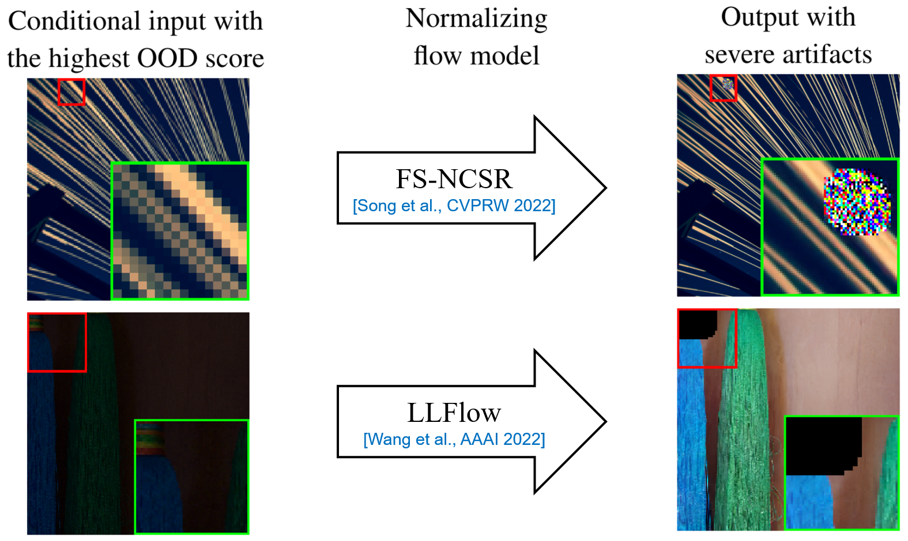
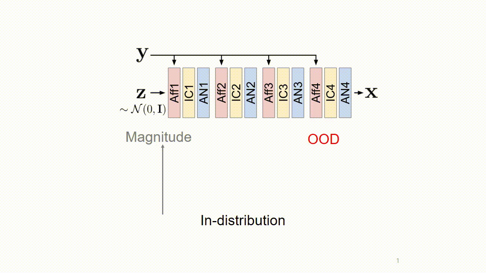
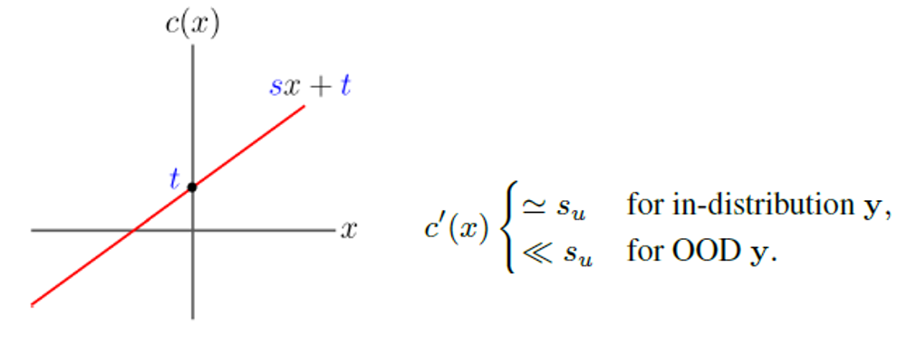
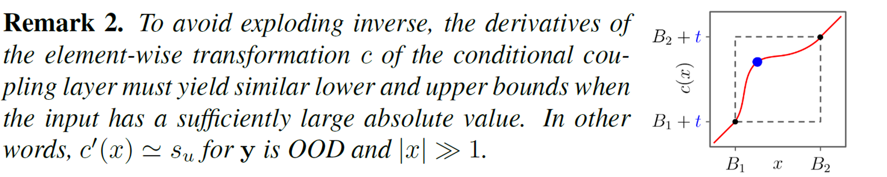
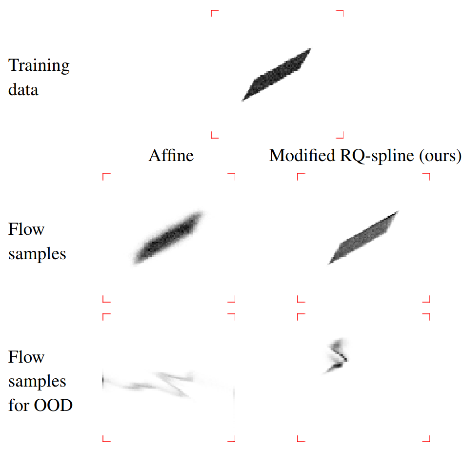
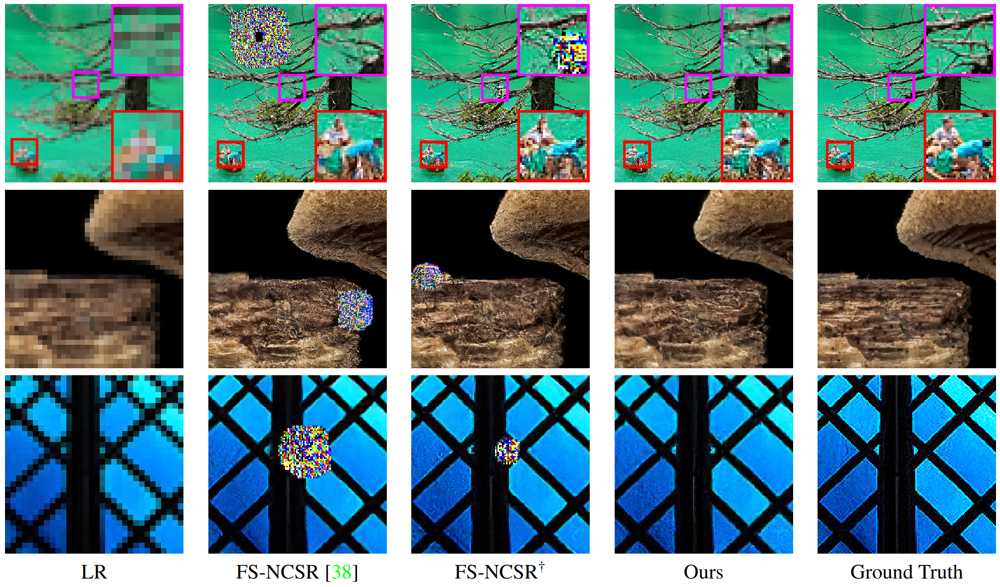
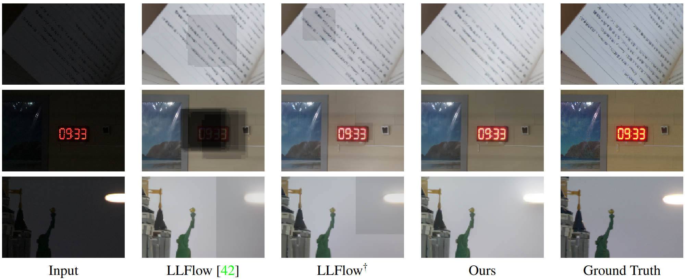

# On the Robustness of Normalizing Flows for Inverse Problems in Imaging

Official repo of On the Robustness of Normalizing Flows for Inverse Problems in Imaging 

by [Seongmin Hong](https://smhongok.github.io/), [Inbum Park](https://inbumpark.github.io/), [Se Young Chun](https://icl.snu.ac.kr/pi),

in ICCV 2023.

Links: [Project webpage](https://smhongok.github.io/robustness.html), [Paper](https://openaccess.thecvf.com/content/ICCV2023/papers/Hong_On_the_Robustness_of_Normalizing_Flows_for_Inverse_Problems_in_ICCV_2023_paper.pdf), [Supp](https://openaccess.thecvf.com/content/ICCV2023/supplemental/Hong_On_the_Robustness_ICCV_2023_supplemental.pdf), [arXiv](https://arxiv.org/abs/2212.04319)


<br><br><br>

<p align="center">
  
</p>

#### <center> Unintended severe artifacts occur in conditional normalizing flows for inverse problems in imaging, which hinder their effectiveness. </center>

<br>

##### **Conditional normalizing flow**: A generative model w/ fastness, diversity.

##### **Inverse Problems in Imaging**: Super-resolution, low-light enhancement, etc.  

<br><br><br>

<p align="center">
  
</p>

#### <center> We found that these artifacts are caused by out-of-distribution (OOD) conditional inputs inducing "exploding inverses" in the conditional affine coupling layer (Aff). </center>

<br>

##### **OOD**: Conditional input (i.e., **y**) whose embedding (i.e., <i>g</i><sub>**θ**</sub> (**y**)) has a large Mahalanobis distance [Lee et al., NeurIPS 2018]  from the training set.

##### **Exploding inverse**: Originally reported in *unconditional* normalizing flows [Behrmann et al., AISTATS 2021], but the mechanism is different from the *conditional* normalizing flow. 

<br><br><br>

<p align="center">
  
</p>

#### <center>Exploding inverse amplifies the magnitude of features, resulting in saturated colors (colorful artifacts) and NaN pixels (black region).</center>

<br><br><br>

<p align="center">
  
</p>

#### <center>We revealed the origin of the errors: The slope (<i>s</i>) of the affine should have an upper bound <i>s<sub>u</sub></i> for training. <i>s</i> ≪ <i>s</i><sub><i>u</i></sub> makes the exploding inverse, and this happens when <b>y</b> is OOD.</center>

<br><br><br>

<p align="center">
  
</p>

#### <center> We propose a remark to avoid the exploding inverse. We then propose a remedy to avoid the exploding inverse: use another one but affine, following Remark 2.</center>

<br>

##### **Another one**: B-spline [<a href="https://smhongok.github.io/nubsf.html">Hong et al., AAAI 2023</a>], or the modified RQ-spline (the figure).

<br><br><br>


<p align="center">
  
</p>
#### <center> To validate our findings, we conducted experiments on a toy dataset, </center>
<br>

<p align="center">
  
</p>
#### <center> super-resolution space generation, </center>
<br>

<p align="center">
  
</p>
#### <center> and  low-light image enhancement. </center>


<br><br><br>

### Abstract
Conditional normalizing flows can generate diverse image samples for solving inverse problems. Most normalizing flows for inverse problems in imaging employ the conditional affine coupling layer that can generate diverse images quickly. However, unintended severe artifacts are occasionally observed in the output of them. In this work, we address this critical issue by investigating the origins of these artifacts and proposing the conditions to avoid them. First of all, we empirically and theoretically reveal that these problems are caused by "exploding inverse" in the conditional affine coupling layer for certain out-of-distribution (OOD) conditional inputs. Then, we further validated that the probability of causing erroneous artifacts in pixels is highly correlated with a Mahalanobis distance-based OOD score for inverse problems in imaging. Lastly, based on our investigations, we propose a remark to avoid exploding inverse and then based on it, we suggest a simple remedy that substitutes the affine coupling layers with the modified rational quadratic spline coupling layers in normalizing flows, to encourage the robustness of generated image samples. Our experimental results demonstrated that our suggested methods effectively suppressed critical artifacts occurring in normalizing flows for super-resolution space generation and low-light image enhancement. 


## References
This code is heavily based on [SRFlow](https://github.com/andreas128/SRFlow), [NCSR](https://github.com/younggeun-kim/NCSR), and [FS-NCSR](https://github.com/dsshim0125/FS-NCSR).


## BibTeX

If our code is helpful for your research, please consider citing
```
@InProceedings{Hong_2023_ICCV,
    author    = {Hong, Seongmin and Park, Inbum and Chun, Se Young},
    title     = {On the Robustness of Normalizing Flows for Inverse Problems in Imaging},
    booktitle = {Proceedings of the IEEE/CVF International Conference on Computer Vision (ICCV)},
    month     = {October},
    year      = {2023},
    pages     = {10745-10755}
}
```
